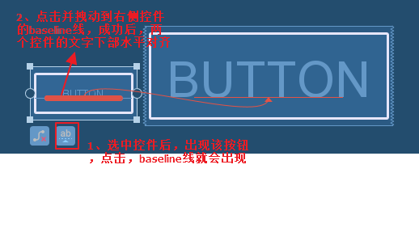
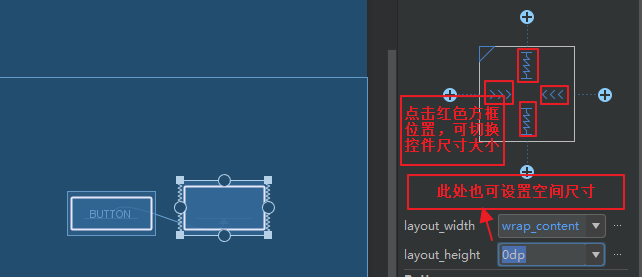
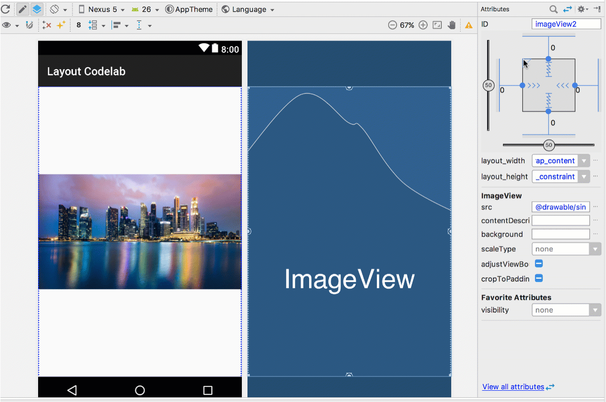
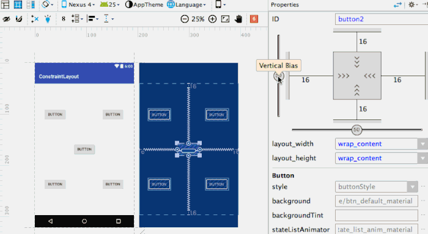
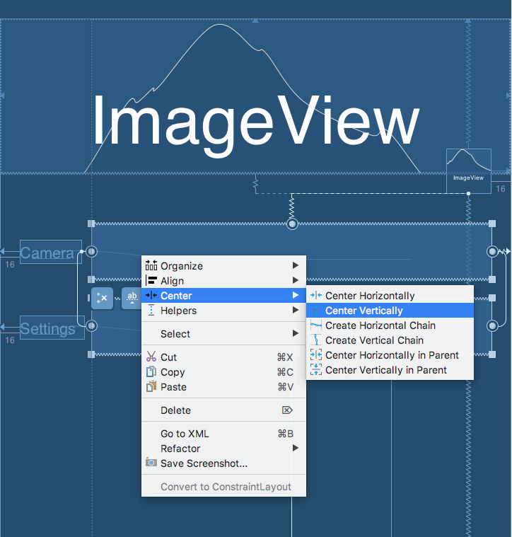
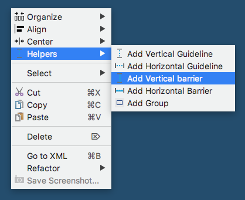
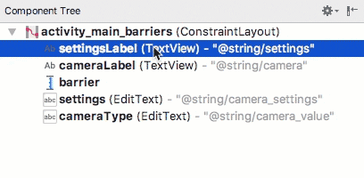

ConstraintLayout常用知识点记录.

>本文主要介绍使用`Layout Editor`来编辑`ConstraintLayout`，是对Google提供的ConstaintLayout Demo的总结。

### 学完本文内容后，你将能够使用Android Studio中的`Layout Editor`构建完成如下的布局。

**你将会到学习到如下知识** 

1. 在布局中自动约束UI元素
2. 在布局中放置元素并调整大小
3. 添加约束定位元素并将其与其他元素对其
4. 调整元素的布局尺寸和边距
5. 自动推断布局约束
6. 使用`barries`来对其动态变化大小的元素
7. 使用`chain`来定位多个元素

#### Layout Editor
打开Android Studio，进入res/layout目录下，打开任意布局文件，点击`Design`标签。

此图片包含以下六个部分：

1. Toolbar
2. Palette
3. Design view
4. Blueprint view
5. Component Tree
6. Attributes

### 确定UI元素的位置及大小

#### 1、确定UI元素的位置

`ConstraintLayout`中的UI元素需添加约束才能确定其在界面中的位置，和`RelativeLayout`很相似，只不过`ContraintLayout`更加强大，增加了其他`barries`和`chain`等等其他功能，同时通过design可以轻松地在`Layout Editor`中进行操作.

首先，何为约束，其实就是UI元素相对其他UI或者parent的位置，从而确定其在界面中的位置。每个UI元素有上下左右四个边，每个边相对其他UI元素或者parent的上下左右四个边的位置，从而有了如下的属性：

    layout_constraintBottom_toBottomOf
    layout_constraintBottom_toTopOf
	layout_constraintEnd_toEndOf
	layout_constraintEnd_toStartOf
	layout_constraintStart_toStartOf
	layout_constraintStart_toEndOf
	layout_constraintTop_toTopOf
	layout_constraintTop_toBottomOf

这几个属性很容易明白，以第一个为例，就是本UI元素的底部和另一个UI元素的底部对其（margin为0dp的时候，如果不为0，则第一个UI元素将高于第二个UI元素margin的值）。

在`Layout Editor`中可以向如下图片所示，通过蓝图实现：

1. 点击UI元素，四个边上显示出小圆圈；
2. 点击圆圈拖动到其他UI元素的边框上，这两个元素就产生了约束。
3. 在最右边`Attributes`中红色方框圈起来的地方，此处可以设置margin值，默认为8dp。

熟悉`RelativeLayout`的童鞋应该知道还有一个`baseline`的属性值，当两个水平方向UI元素中的字体大小不一样时，设置该属性可以使两个UI元素的文字下部处于水平直线。

	
#### 2、确定UI元素的大小
`ConstraintLayout`容器中的UI元素尺寸大小主要有以下三种方式：

1. 固定大小:宽高固定具体大小
2. `Wrap Content`：跟以前布局一样，包裹内容大小
3. `Match Constraints`：相当于0dp(表示填充约束中所有可用空间)，如果只是长或者宽单独设置成0dp，则该0dp不生效

在`Layout Editor`中可以向如下图片所示，通过蓝图设置UI元素的尺寸：

#### 自动推断布局约束
总共有两种方法：`Autoconnect` 和`infer constraints`

1. `Autoconnect`：点击打开自动连接按钮 ,拖拽UI元素到布局文件中后，会自动推断生成约束。
2.`infer constraints`：先关闭自动连接按钮 ,拖拽多个元素到布局文件，并大致排列好后，然后点击，将会自动生成整体约束布局。

#### 4、几个特殊的属性
- `ratios`：设置UI元素的宽高比例
  注意：只有UI元素的宽或者高为`wrap content`或者固定值，另一边为0dp，设置才生效。
  

- bias：调整约束的比例 
  
  
- chains：将多个view垂直或者水平关联起来，使多个view相对约束一起移动
  
  
#### 辅助工具

- `guide line`

  垂直或水平的一条线，会显示当前位置的大小，方便我们绘制布局，仅仅其参照作用。

- `barries`

  

  当布局随着本地化变化的时候，可能会出现如下问题，这时，我们就需要左边两个UI元素永远居于右边两个UI元素的左边，且不能出现交叉覆盖。
  这个时候，barriers就能很好地为我们解决这种问题。

1. 添加垂直方向的barriers；

   

2. 在`Conponent Tree`中将左边两个button拽到barriers中，并且居于barriers的左边；

    

3. 右边两个EditText添加约束到barriers，这样就大功告成。

参考文档：[https://storage.googleapis.com/clmirror/codelabs/constraint-layout/index.html#0](https://storage.googleapis.com/clmirror/codelabs/constraint-layout/index.html#0)

